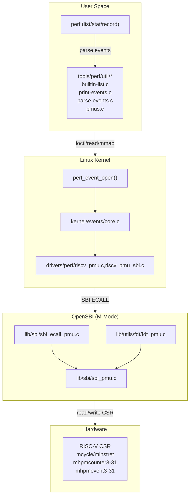
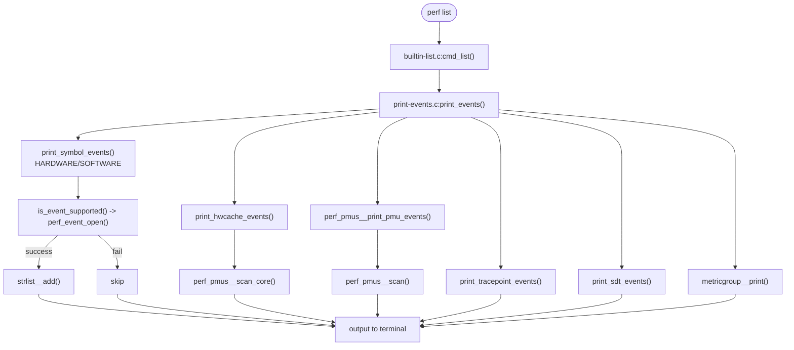
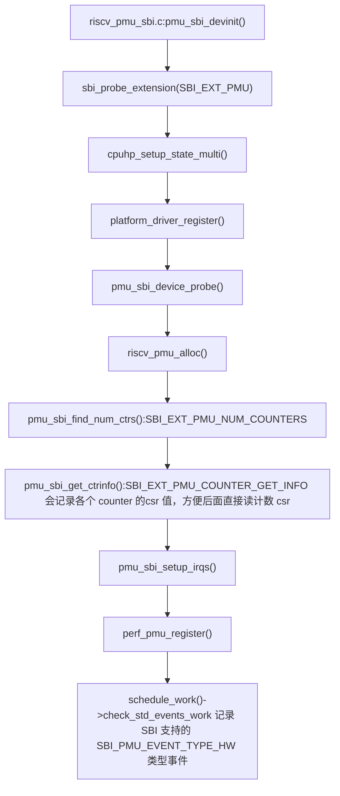
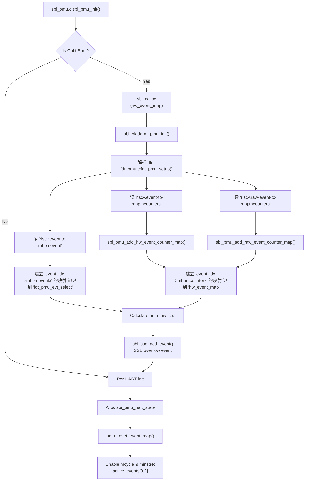

+++
title = "RISC-V Perf 代码原理分析"
date = 2026-03-26T19:22:22.781734+08:00
tags = ["riscv", "linux"]
categories = ["riscv_linux"]
+++
# RISC-V Perf 代码原理分析

本文档从 **perf**（用户态工具）、**riscv_pmu**（Linux 内核驱动）、**OpenSBI**（固件层）三个维度分析 RISC-V 性能监控单元（PMU）的工作原理。

---

# 1. 整体架构概述



---

# 2. perf 用户态工具

## 2.1 事件查找流程

perf 用户态工具负责解析用户输入的事件名称，并将其转换为内核可识别的配置。

### 2.1.1 主要源文件

| 文件 | 功能 |
| --- | --- |
| `tools/perf/builtin-list.c` | `perf list` 命令实现，列出所有可用事件 |
| `tools/perf/util/print-events.c` | 打印事件信息，支持硬件/软件/缓存/Tracepoint 事件 |
| `tools/perf/util/parse-events.c` | 解析用户输入的事件字符串，例如解析 `-e cpu/event=0x2000d,firmware=0x0/` |
| `tools/perf/util/pmus.c` | 扫描 sysfs 中的 PMU 设备 |
| `tools/perf/util/pmu.c` | PMU 详细信息读取和解析 |

### 2.1.2 perf list 流程



### 2.1.3 事件类型

perf 支持以下事件类型：

| 类型 | 说明 | perf 类型常量 |
| --- | --- | --- |
| 硬件事件 | CPU 周期、指令数、缓存命中等 | `PERF_TYPE_HARDWARE` |
| 软件事件 | 上下文切换、页错误等 | `PERF_TYPE_SOFTWARE` |
| 缓存事件 | L1/L2/L3 缓存访问/命中 | `PERF_TYPE_HW_CACHE` |
| Tracepoint | 内核静态追踪点 | `PERF_TYPE_TRACEPOINT` |
| 原始事件 | 架构特定的原始事件 | `PERF_TYPE_RAW` |

### 2.1.4 RISC-V 事件映射

在 `riscv_pmu_sbi.c` 中定义了 Perf事件 到 SBI PMU 事件索引的映射：

```c
// drivers/perf/riscv_pmu_sbi.c
// perf 通用事件到 sbi pmu type0 事件的映射
static struct sbi_pmu_event_data pmu_hw_event_map[] = {
    [PERF_COUNT_HW_CPU_CYCLES]      = {.hw_gen_event = {SBI_PMU_HW_CPU_CYCLES,      SBI_PMU_EVENT_TYPE_HW, 0}},
    [PERF_COUNT_HW_INSTRUCTIONS]     = {.hw_gen_event = {SBI_PMU_HW_INSTRUCTIONS,     SBI_PMU_EVENT_TYPE_HW, 0}},
    // ... 更多事件
};

// perf cache事件到 sbi pmu type1 事件的映射
#define C(x) PERF_COUNT_HW_CACHE_##x
static struct sbi_pmu_event_data pmu_cache_event_map[PERF_COUNT_HW_CACHE_MAX]
[PERF_COUNT_HW_CACHE_OP_MAX]
[PERF_COUNT_HW_CACHE_RESULT_MAX] = {
	[C(L1D)] = {
		[C(OP_READ)] = {
			[C(RESULT_ACCESS)] = {.hw_cache_event = {C(RESULT_ACCESS),
					C(OP_READ), C(L1D), SBI_PMU_EVENT_TYPE_CACHE, 0}},
			[C(RESULT_MISS)] = {.hw_cache_event = {C(RESULT_MISS),
					C(OP_READ), C(L1D), SBI_PMU_EVENT_TYPE_CACHE, 0}},
		},
        // ... 更多事件
	},
    // ... 更多事件
};
```

### 2.1.5 事件解析流程

当用户执行 `perf stat -e cycles` 时：

```c
perf stat -e cycles
    │
    ▼
parse_events()                     [parse-events.c]
    │
    ├─> parse_events__scanner()     // 词法分析
    │   └─> parse_events_parse()   // 语法分析
    │
    ├─> add_event()                 // 添加事件
    │   └─> __add_event()          // 创建 evsel
    │
    └─> evsel__open()               // 打开事件 (核心!)
        │
        └─> sys_perf_event_open()   // 系统调用
            │
            ▼
        [kernel/events/core.c]
```

---

# 3. Linux 内核 RISC-V PMU 驱动

## 3.1 驱动架构

### 3.1.1 主要源文件

| 文件 | 功能 |
| --- | --- |
| `drivers/perf/riscv_pmu.c` | RISC-V PMU 通用框架 |
| `drivers/perf/riscv_pmu_sbi.c` | SBI PMU 扩展实现 |

### 3.1.2 核心数据结构

```c
// include/linux/perf/riscv_pmu.h
// 在 drivers/perf/riscv_pmu.c:riscv_pmu_alloc 中初始化
struct riscv_pmu {
    struct pmu pmu;                        // Linux PMU 框架
            // pmu 通用框架的接口的初始化
            pmu->pmu = (struct pmu) {
                .event_init	= riscv_pmu_event_init, // perf调用步骤，1. 检查 event 是否可用
                .event_mapped	= riscv_pmu_event_mapped,
                .event_unmapped	= riscv_pmu_event_unmapped,
                .event_idx	= riscv_pmu_event_idx,
                .add		= riscv_pmu_add, // 2. 获取可以用的 counter idx
                .del		= riscv_pmu_del, // 6. 删除 counter idx 的占用
                .start		= riscv_pmu_start, // 3. 启动 counter
                .stop		= riscv_pmu_stop, // 4. 停止 counter
                .read		= riscv_pmu_read, // 5. 读取 counter 值
            };
    struct cpu_hw_events __percpu *hw_events; // 每 CPU 事件状态
    unsigned long cmask;                    // 可用计数器位掩码

    // 函数指针 (由具体实现填充)，会被 `struct pmu pmu` 调用
    int  (*event_map)(struct perf_event *event, u64 *econfig);
    int  (*ctr_get_idx)(struct perf_event *event);
    int  (*ctr_get_width)(int idx);
    void (*ctr_start)(struct perf_event *event, u64 ival);
    void (*ctr_stop)(struct perf_event *event, unsigned long flag);
    u64  (*ctr_read)(struct perf_event *event);
    void (*event_init)(struct perf_event *event);
    void (*event_mapped)(struct perf_event *event, struct mm_struct *mm);
    void (*event_unmapped)(struct perf_event *event, struct mm_struct *mm);
    u8   (*csr_index)(struct perf_event *event);
};
```

## 3.2 初始化流程



## 3.3 运行时流程

### 3.3.1 perf_event_open() 系统调用, event_idx/event_data 初始化

当用户空间调用 `perf_event_open()` 时，内核执行以下流程：

```c
perf_event_open()
    │
    ├─> sys_perf_event_open()          [kernel/events/core.c]
    │   │
    │   └─> perf_event_create_kernel_context()
    │       │
    │       └─> event->pmu->event_init()  // 调用 riscv_pmu_event_init()
    │
    ▼
riscv_pmu_event_init()                [riscv_pmu.c]
    │
    ├─> rvpmu->event_map(event, &event_config)
    │   └─> pmu_sbi_event_map()        [riscv_pmu_sbi.c]
    │       │
    │       ├─> PERF_TYPE_HARDWARE     // 查 pmu_hw_event_map
    │       ├─> PERF_TYPE_HW_CACHE     // 查 pmu_cache_event_map
    │       └─> PERF_TYPE_RAW          // 直接返回 RAW 事件 ID（raw event_idx（0x20000, 0x30000 还没支持）），
    |                                  // 并将 attr.config 中的 event 字段（attr.config[47:0]）作为 event_data
    │
    ├─> hwc->config = event_config     // 保存事件配置, 对应 sbi 中的 event_data
    ├─> hwc->idx = -1                  // 尚未分配计数器
    └─> hwc->event_base = mapped_event  // 事件索引，对应 sbi 中的 event_idx
```

### 3.3.2 计数器分配 (pmu_add)，配置和启动 counter

当事件绑定到计数器时：

```c
perf_event_enable()
    │
    ├─> event->pmu->add()
    │   └─> riscv_pmu_add()           [riscv_pmu.c]
    │       │
    │       ├─> rvpmu->ctr_get_idx(event)  // 获取可用计数器
    │       │   └─> pmu_sbi_ctr_get_idx()  [riscv_pmu_sbi.c]
    │       │       │
    │       │       └─> sbi_ecall(SBI_EXT_PMU_COUNTER_CFG_MATCH, ...)
    │       │           │
    │       │           // 这个调用在 OpenSBI 中完成:
    │       │           // 1. 根据 event_idx 查找匹配的计数器
    │       │           // 2. 配置对应 mhpmevent，控制对应的过滤位
    │       │           // 3. 返回计数器索引
    │       │
    │       ├─> cpuc->events[idx] = event // 记录当前哪些事件被使用
    │       ├─> cpuc->n_events++
    │       │
    │       └─> riscv_pmu_start(event, flags)
    │           │
    │           ├─> riscv_pmu_event_set_period() // 设置采样周期
    │           └─> rvpmu->ctr_start(event, init_val) // 初始化对应 counter csr
    │               └─> pmu_sbi_ctr_start()      [riscv_pmu_sbi.c]
    │                   │
    │                   └─> sbi_ecall(SBI_EXT_PMU_COUNTER_START, ...)
    │                       └─> OpenSBI: sbi_pmu_ctr_start()
																// 1. 设置 init_val 为 counter csr (mcycle、minstret、mhpmcounter3-31)的初始值
																// 2. 配置 mcountinhibit 对应 bit，启用计数
```

### 3.3.3 计数器读取 (pmu_read)

```c
perf_event_read()
    │
    └─> event->pmu->read()
        └─> riscv_pmu_read()          [riscv_pmu.c]
            │
            └─> riscv_pmu_event_update(event)
                │
                ├─> rvpmu->ctr_read(event)
                │   └─> pmu_sbi_ctr_read() [riscv_pmu_sbi.c]
                │       │
                │       ├─> firmware 事件:
                │       │   └─> sbi_ecall(SBI_EXT_PMU_COUNTER_FW_READ)
                │       │
                │       └─> hardware 事件:
                │           └─> sbi_ecall(SBI_EXT_PMU_COUNTER_READ) // 本来是直接读 hpmcounterx，由于 p100 不能读 hpmcounterx，自定义了一个 sbi 接口
                ├─> local64_cmpxchg(&hwc->prev_count, prev_raw_count, new_raw_count); // 记录 csr 中的原始值
                ├─> delta = (new_raw_count - old_raw_count) & cmask
                ├─> local64_add(delta, &event->count) // 更新总数
                └─> local64_sub(delta, &hwc->period_left) // 更新距离 event->hw->sample_period 的计数
```

### 3.3.4 计数器停止 (pmu_stop)

```c
perf_event_disable()
    │
    └─> event->pmu->stop()
        └─> riscv_pmu_stop()          [riscv_pmu.c]
            │
            ├─> rvpmu->ctr_stop(event, 0)
            │   └─> pmu_sbi_ctr_stop() [riscv_pmu_sbi.c]
            │       │
            │       └─> sbi_ecall(SBI_EXT_PMU_COUNTER_STOP, ...)
            │
            └─> riscv_pmu_event_update(event)
```

## 3.4 采样周期设置原理 (riscv_pmu_event_set_period)

这是 Perf 的核心算法，用于实现**采样中断**功能。在 `riscv_pmu_start()` 中调用。

### 3.4.1 核心数据结构

```c
struct hw_perf_event {
    u64 sample_period;      // 期望的采样周期（期望的目标计数，计数达到此值时触发中断）
    u64 last_period;        // 上一次的采样周期（上一次的目标计数）
    u64 period_left;        // 距离目标计数还剩多少计数，即 `sample_period - prev_count`
                            // 其负数作为 counter 的初始值，这样增加计数，需要计数到 2period_left 才到达 sample_period
    u64 prev_count;         // 上一次读取的计数器值（软件记录）
    // ...
};

struct perf_event {
    // ...
	local64_t			count; // 整个采样过程已经记录的 count 数
    // ...
}
```

### 3.4.2 算法详解

```c
int riscv_pmu_event_set_period(struct perf_event *event)
{
    struct hw_perf_event *hwc = &event->hw;
    s64 left = local64_read(&hwc->period_left);  // 读取剩余计数
    s64 period = hwc->sample_period;              // 目标采样周期(目标计数)
    int overflow = 0;
    uint64_t max_period = riscv_pmu_ctr_get_width_mask(event);  // 计数器位掩码，最大计数值

    // left 有效范围为 [0, 2period]，超过范围的情况要重新配置 period_left
    // 情况1: left 已经是负数且绝对值大于等于 period
    // 说明之前已经溢出了 period 个数，需要重置 period_left
    if (unlikely(left <= -period)) {
        left = period;
        local64_set(&hwc->period_left, left);
        hwc->last_period = period;
        overflow = 1;
    }

    // 情况2: left <= 0，说明之前发生了溢出但不够严重
    if (unlikely(left <= 0)) {
        left += period;
        local64_set(&hwc->period_left, left);
        hwc->last_period = period;
        overflow = 1;
    }

    // 限制最大周期，防止计数器值超过要设置的值
    // 考虑中断延迟，保守地设置为宽度的一半
    if (left > (max_period >> 1))
        left = (max_period >> 1);

    // ★ 核心技巧: 使用负数作为初始值
    // prev_count 会写入硬件计数器 CSR
    local64_set(&hwc->prev_count, (u64)-left);

    perf_event_update_userpage(event);
    return overflow;
}
```

### 3.4.3 负数初始值技巧

这是 Perf 实现采样的关键技巧：

1. **假设** `left = 1000`（剩余要计数 1000 次触发中断）
2. **设置** `prev_count = -1000`（补码表示为 `0xFFFFFC18`）
3. **硬件行为**：
    - 计数器从 0xFFFFFC18 开始递增：0xFFFFFC18 → 0xFFFFFC19 → ... → 0
    - 继续递增：0 → ... → 1000
4. **实际计数**：从 -1000 到 0 是 1000，从 0 到 1000 也是 1000，总体计数就可以到 2000 了
5. **触发中断**：当计数达到 1000 时溢出，触发 perf 采样中断

### 3.4.4 计数器读取 (riscv_pmu_event_update)

在计数器停止或读取时调用，计算增量：

```c
u64 riscv_pmu_event_update(struct perf_event *event)
{
    // 使用 CAS 确保原子性，防止并发读取
    do {
        prev_raw_count = local64_read(&hwc->prev_count);
        new_raw_count = rvpmu->ctr_read(event);  // 读取硬件 CSR
    } while (local64_cmpxchg(&hwc->prev_count, prev_raw_count, new_raw_count) != prev_raw_count);

    // 计算增量（处理溢出回绕）
    delta = (new_raw_count - prev_raw_count) & cmask;

    // 更新统计
    local64_add(delta, &event->count);        // 总计数
    local64_sub(delta, &hwc->period_left);   // 剩余计数

    return delta;
}
```

---

# 4. OpenSBI 固件层

## 4.1 PMU 扩展概述

OpenSBI 实现了 SBI PMU 扩展（`SBI_EXT_PMU`），为 S-Mode（Linux）提供性能监控功能。

## 4.2 主要源文件

| 文件 | 功能 |
| --- | --- |
| `lib/sbi/sbi_ecall_pmu.c` | SBI ECALL 处理接口 |
| `lib/sbi/sbi_pmu.c` | PMU 核心实现 |
| `lib/utils/fdt/fdt_pmu.c` | Device Tree 解析 |

## 4.3 初始化流程



## 4.4 ECALL 处理流程

```c
SBI PMU ECALL(SBI_EXT_PMU)
    │
    ├─> sbi_ecall_pmu_handler()      [sbi_ecall_pmu.c]
    │
    ├─> SBI_EXT_PMU_NUM_COUNTERS
    │   └─> sbi_pmu_num_ctr()
    │
    ├─> SBI_EXT_PMU_COUNTER_GET_INFO
    │   └─> sbi_pmu_ctr_get_info()
    │       // 返回计数器信息: CSR编号, 宽度, 类型
    │
    ├─> SBI_EXT_PMU_COUNTER_CFG_MATCH  // ★ 核心
    │   └─> sbi_pmu_ctr_cfg_match()
    │       │
    │       ├─> pmu_event_validate()      // 验证事件
    │       │
    │       ├─> pmu_ctr_find_hw()         // 查找可用计数器
    │       │   │
    │       │   └─> 遍历 hw_event_map
    │       │       // 根据 event_idx 找到合适 counter 范围，再从中获取到空闲的 counter_id
    │       │       // cycle 和 instret 不用配置 mhpmevent，会直接调用 pmu_fixed_ctr_update_inhibit_bits 配置 mcyclecfg/minstretcfg 后直接返回
    │       │
    │       ├─> pmu_update_hw_mhpmevent() // 配置 mhpmevent CSR，会根据上层提供的过滤flag，配置 mhpmevent 中的对应 inhibit bits，限制某些特权级的计数
    │       │   │
    │       │   └─> sbi_platform_pmu_xlate_to_mhpmevent()
    │       │       // 获取 event_id 对应的 mhpmevent 值
    │       │       │
	  │       │       └─> generic_pmu_xlate_to_mhpmevent()
    │       │           // 1. SBI_PMU_EVENT_RAW_IDX/SBI_PMU_EVENT_RAW_V2_IDX 类型，根据软件填充的 data 填充 mhpmevent
    │       │           // 2. 其他类型，根据 fdt_pmu_evt_select 的值（dts 中 'riscv,event-to-mhpmevent'）填充 mhpmevent
    │       │
    │       └─> phs->active_events[ctr_idx] = event_idx
    │           // 记录已分配的计数器
    │
    ├─> SBI_EXT_PMU_COUNTER_START
    │   └─> sbi_pmu_ctr_start()
    │       │
    │       ├─> pmu_ctr_start_hw()
    │       │   │
    │       │   ├─> 清除 mcountinhibit 对应位，启动计数
    │       │   ├─> 启用溢出中断 (如果支持 sscofpmf)
    │       │   └─> 写入初始值到计数器 CSR
    │       │
    │       └─> pmu_ctr_start_fw()
    │
    ├─> SBI_EXT_PMU_COUNTER_STOP
    │   └─> sbi_pmu_ctr_stop()
    │       │
    │       ├─> pmu_ctr_stop_hw()
    │       │   │
    │       │   ├─> 设置 mcountinhibit 对应位，停止计数
    │       │   └─> 禁用溢出中断
    │       │
    │       └─> pmu_ctr_stop_fw()
    │
    ├─> SBI_EXT_PMU_COUNTER_FW_READ
    │   └─> sbi_pmu_ctr_fw_read()
    │
    └─> SBI_EXT_PMU_COUNTER_READ
        └─> 直接读取 CSR (mcycle + cidx)
```

---

# 5. 数据流总结

## 5.1 perf list 时的数据流

```
1. perf list
│
2. 查找 cpu 通用的 event 事件 (静态数组定义，如 cache-misses, branch-misses 等)
│
3. 查找自定义的 pmu event，扫描 /sys/bus/event_source/devices/cpu/
│
4. 对每个事件调用 perf_event_open() 检查是否支持
│   (在 is_event_supported() 中)
│
5. 将支持的事件输出到终端
```

## 5.2 perf stat 时的数据流

```
1. perf stat -e cycles ./program
│
2. 解析 "-e cycles"
│   - 查表: cycles -> PERF_COUNT_HW_CPU_CYCLES
│   - 再映射: PERF_COUNT_HW_CPU_CYCLES -> SBI_PMU_HW_CPU_CYCLES (0x01)
│
3. perf_event_open() 创建性能事件
│   - type = PERF_TYPE_HARDWARE
│   - config = PERF_COUNT_HW_CPU_CYCLES
│
4. 内核调用 riscv_pmu_event_init()
│   - pmu_sbi_event_map() 将 config 转换为 event_idx
│
5. perf_event_enable() 启用事件
│   - riscv_pmu_add() 获取计数器索引
│   - sbi_ecall(SBI_PMU_COUNTER_CFG_MATCH) 配置 mhpmevent
│   - sbi_ecall(SBI_PMU_COUNTER_START) 启动计数器
│
6. 程序运行期间
│   - 计数器递增
│   - 发生溢出时触发中断 (如果启用)
│
7. perf_event_read() 读取计数值
│   - sbi_ecall(SBI_PMU_COUNTER_READ) 读取 CSR
│
8. 输出统计结果
```

---

# 6. 关键数据结构

## 6.1 perf_event_attr (用户态定义事件)

```c
struct perf_event_attr {
    __u32 type;           // 事件类型 (HARDWARE/SOFTWARE/RAW...)
    __u64 config;         // 事件配置，
                          // type 为 hw，该值为 PERF_COUNT_HW_CPU_CYCLES...
                          // type 为 raw，bits[47:0] 为 event_data
    __u64 config1;        // 扩展配置1
    __u64 config2;        // 扩展配置2
    __u64 sample_period;  // 采样周期
    // ... 更多字段
};
```

## 6.2 PMU 事件映射

```c
// OpenSBI 中事件索引编码
// event_idx = (type << SBI_PMU_EVENT_IDX_TYPE_OFFSET) | code
// 其中 SBI_PMU_EVENT_IDX_TYPE_OFFSET = 12
//
// type: SBI_PMU_EVENT_TYPE_HW (0x0)           - 硬件事件 (如 cycles, instructions)
//       SBI_PMU_EVENT_TYPE_HW_CACHE (0x1)      - 缓存事件 (如 L1D, L1I)
//       SBI_PMU_EVENT_TYPE_HW_RAW (0x2)        - 原始硬件事件 (v1)
//       SBI_PMU_EVENT_TYPE_HW_RAW_V2 (0x3)     - 原始硬件事件 (v2, 64位 event_data)
//       SBI_PMU_EVENT_TYPE_FW (0xf)            - 固件事件 (如 firmware counter)
```

## 6.3 计数器信息

```c
// OpenSBI 返回的计数器信息
union sbi_pmu_ctr_info {
    unsigned long value;
    struct {
        unsigned long csr:12;    // CSR 编号
        unsigned long width:6;   // 计数器宽度
        unsigned long reserved;
        unsigned long type:1;    // 0=HW, 1=FW
    };
};
```

---

# 7. 适配自定义事件（raw type event）

目前的代码中没有适配 PERF_TYPE_RAW 事件的添加，即不支持 SBI_PMU_EVENT_TYPE_RAW，需要用户自行添加 sysfs 文件节点 或者 在 tools/perf/pmu-events/arch/riscv/ 中添加 pmu 的 json 文件。

## 7.1 通过添加 sysfs 事件节点

```c
// 1. 添加 event 文件节点 wjl_test，输出内容为 "event=0x2000d"
PMU_EVENT_ATTR_STRING(wjl_test, event_attr_test, "event=0x2000d");
	/* 
		等效于 firmware=0x0,event=0x2000d
		event 表示填充到 attr.config.event 的值, 这个值要和 dts 中的 riscv,raw-event-to-mhpmcounters 对应
		可以通过 -e wjl_test 选用事件
		也可以通过 -e cpu/event=0x2000d,firmware=0x0/[cpu/wjl_test/] 选用事件
		
		因为 /sys/bus/event_source/devices/cpu/format 下：
		event = "config:0-47", firmware = "config:62-63"，因此：
		- `event=0x2000d` 被解析到 `perf_event_attr.config` 的 bits[0-47]
		- `firmware=0x0` 被解析到 `perf_event_attr.config` 的 bits[62-63]
	 */

static struct attribute *riscv_arch_events_attr[] = {
	&event_attr_test.attr.attr,
	NULL,
};

// 2. 添加 events 目录，包含上面的 wjl_test 文件
static const struct attribute_group riscv_pmu_events_group = {
	.name = "events",
	.attrs = riscv_arch_events_attr,
};

// 3. 添加 events 目录到 /sys/bus/event_source/devices/cpu/ 目录下
static const struct attribute_group *riscv_pmu_attr_groups[] = {
	&riscv_pmu_events_group,
	&riscv_pmu_format_group,
	NULL,
};
```

## **7.2 通过 perf 工具中添加 json 文件**

### 7.2.1 添加 perf 查找 json 文件的路径

```bash
# perf 会根据 csr_mvendorid,marchid,mimpid(`从 /proc/cpuinfo 中获取`) 或者 
# 环境变量PERF_CPUID(`export PERF_CPUID="0x218-0x0-0x0"`)
# 拼接成的 MVENDORID-MARCHID-MIMPID 从 mapfile.csv 中查找 json 文件
# tools/perf/pmu-events/arch/riscv/mapfile.csv 中添加
# MVENDORID-MARCHID-MIMPID,Version,Filename,EventType
# ...
0x218-0x0-0x0,v1,lrzx/p100,core
# ...
```

### 7.2.2 添加 perf json 文件

```json
// tools/perf/pmu-events/arch/riscv/lrzx/p100/common.json
// EventCode = firmware << 62 | event
// raw event, firmware==0, event==event_data
[
	{
		"EventCode": "0x20000",
		"EventName": "stall_bru_cru",
		"BriefDescription": "Completion stall due to thread conflict. Completion stall due to IFU (Instruction Fetch Unit)."
	},
	// ...
	{
		"EventCode": "0x2002b",
		"EventName": "run_inst_cmpl",
		"BriefDescription": "Run instructions completed"
	}
]

// 编译成功后，tools/perf/pmu-events/pmu-events.c:pmu_events_map 会添加新加的事件
```

## 7.3 支持 SBI_PMU_EVENT_TYPE_HW_RAW_V2

`drivers/perf/riscv_pmu_sbi.c` 并没有支持 `SBI_PMU_EVENT_TYPE_HW_RAW_V2`，需要做以下修改：

1. **修改 format 定义**，扩展 event 字段占用 attr.config 中的位数：
    
    ```c
    // 原来: PMU_FORMAT_ATTR(event, "config:0-47");
    // 修改为:
    PMU_FORMAT_ATTR(event, "config:0-55");
    ```
    
2. **修改事件映射接口**，适配 56 位 event_data 的位宽：
    
    ```c
    // pmu_sbi_event_map 接口中
    case PERF_TYPE_RAW:
        *econfig = config & RISCV_PMU_RAW_EVENT_MASK; // RISCV_PMU_RAW_EVENT_MASK 改为支持 56 bits 的mask
        break;
    ```
    

---

# 8. 调试技巧

## 8.1 查看可用事件

```bash
# 列出所有事件
perf list

# 查看 CPU PMU 事件，数据来源 /sys/bus/event_source/devices/cpu/events/
perf list pmu

# 查看 PMU 格式定义，即 `/sys/bus/event_source/devices/cpu/events/xx` 文件中记录的字段怎么配置到 attr.config 的
cat /sys/bus/event_source/devices/cpu/format/*
```

## 8.2 使用原始事件

```bash
# 使用原始事件编码 (需要知道 mhpmevent 的值（event_data）)
# event=0x2000d,firmware=0x0 为 /sys/bus/event_source/devices/cpu/events/wjl_test 记录的值
perf stat -e cpu/event=0x2000d,firmware=0x0/
# 也可以直接通过文件名索引
perf stat -e cpu/wjl_test/

# 通过设备树查看支持的事件映射
cat /proc/device-tree/pmu/riscv,raw-event-to-mhpmcounters
```

## 8.3 调试内核

```c
// 开启 DEBUG 调试
#define DEBUG 1

// 在 riscv_pmu_event_update() 中添加日志
pr_info("prev_raw_count %llx, new_raw_count %llx\\n",
         prev_raw_count, new_raw_count);
```

---

# 9. 总结

RISC-V Perf 架构是一个分层设计：

1. **perf 用户态**：解析事件名称，验证事件可用性
2. **Linux 内核驱动**：管理事件到计数器的映射，处理计数器的分配和读写
3. **OpenSBI 固件**：实现 SBI PMU 扩展，管理硬件计数器 CSR，处理事件配置